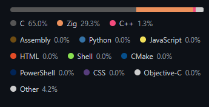

# LangBadge

## Example Image

**Zig Repo:**



## How use

### Local

```bash
cargo run -- repo --style=github-ui
```

or

```bash
langbadge repo --style=github-ui
```

---

**parallel processing:**

```bash
cargo run -- repo/ --style=github-ui --fast
```

or

```bash
langbadge repo/ --style=github-ui --fast
```

---

### Git

```bash
cargo run -- https://github.com/wavefnd/Wave --style=github-ui
```

or

```bash
langbadge https://github.com/wavefnd/Wave --style=github-ui
```

---

**parallel processing:**

```bash
cargo run -- https://github.com/wavefnd/Wave --style=github-ui --fast
```

or

```bash
langbadge https://github.com/wavefnd/Wave --style=github-ui --fast
```
